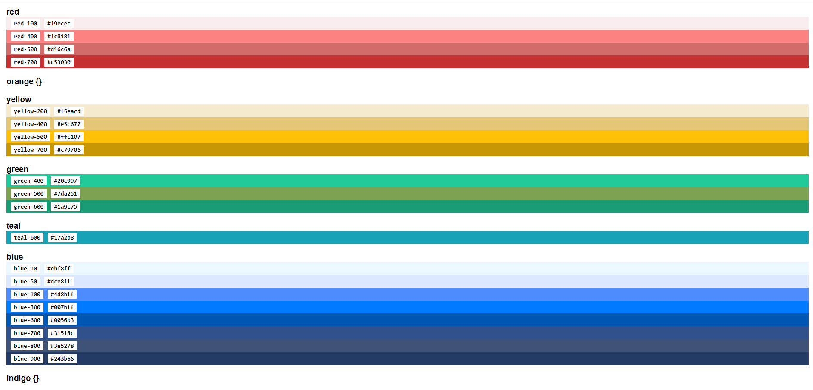

# Tailwind Color Spectrum

If you use Tailwind CSS and you have a lot of custom colors in your <code>tailwind.config.js</code> file, it can get confusing. With this tool, you can paste the contents of your entire config file into a textarea and see what colors and color classes you're using. Click on a color bar to copy its class suffix to you clipboard.

You can use it [here](https://thischrisblack.github.io/tailwind-config-spectrum/).

